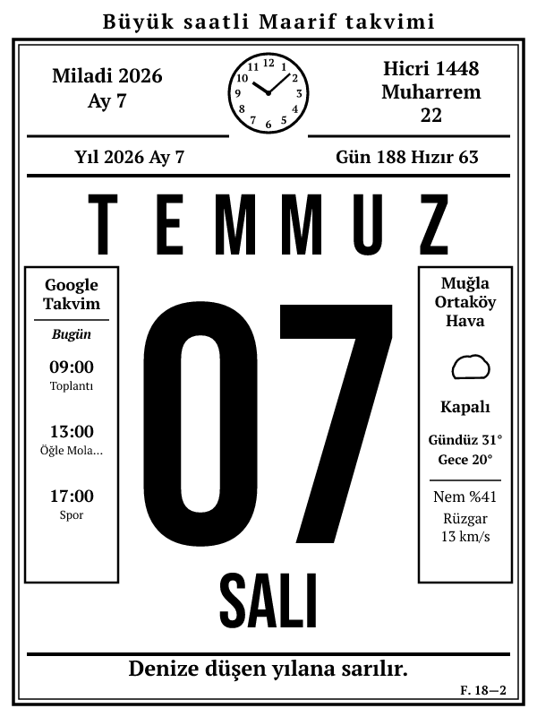

# Saatli Maarif Takvimi — e-ink (Kindle) Panosu

Klasik **Büyük Saatli Maarif Takvimi** yaprağını birebir taklit eden, eski bir
Kindle'ı duvar takvimine dönüştüren gösterge panosu. Sol tarafta Google Takvim,
ortada dev gün numarası + analog saat + Hicri/Hızır bilgisi, sağda hava durumu,
altta günün sözü.

> *A dashboard that turns an old Kindle into a classic Turkish tear-off wall
> calendar ("Saatli Maarif Takvimi") — Google Calendar, weather, Hijri date and
> a quote of the day, server-rendered to a single e-ink friendly PNG.*

**Canlı demo:** https://maarif-demo.external.emre.zip — İstanbul/Kadıköy havası +
örnek Dünya Kupası 2026 fikstürü ([data/demo-worldcup.ics](data/demo-worldcup.ics)),
tamamen env değişkenleriyle yapılandırılmış.



## Nasıl çalışır?

Eski Kindle tarayıcıları (2011-2016 WebKit) modern CSS'i ve `@font-face`'i
güvenilir çalıştırmaz. Bu yüzden sayfa **sunucuda SVG olarak çizilir ve PNG'ye
rasterize edilir** (`@resvg/resvg-js`). Cihaz yalnızca tam ekran bir PNG
gösterir → fontlar ve düzen her cihazda piksel piksel aynıdır.

Fontlar gömülüdür (OFL): **Bebas Neue** (dev tarih öğeleri), **PT Serif**
(kutular, başlıklar, günün sözü). `fonts/` altında Barlow Condensed Black ve
Anton da hazır durur — `src/render.js` içindeki `DISPLAY` sabitini değiştirerek
denenebilir.

## Özellikler

- **Google Takvim** (gizli ICS): tekrarlayan etkinlikler (RRULE), iptaller
  (EXDATE), taşınmış tekil tekrarlar (RECURRENCE-ID), çok günlük/tüm gün
  etkinlikler. Emoji'ler ayıklanır, davet+sahip kopyaları tekilleştirilir,
  **bitmiş etkinlikler düşer**, **reddedilen davetler gizlenir**, gürültü
  etkinlikleri (`CALENDAR_HIDE`) filtrelenir. Akşam `ROLLOVER_HOUR`'dan sonra
  kutu "Yarın" etiketiyle ertesi günün programına döner.
- **Hava durumu**: Open-Meteo (API anahtarı gerekmez) — gündüz/gece sıcaklığı,
  durum + ikon, nem, rüzgar.
- **Hicri tarih** (Umm al-Qura) ve **Rûz-ı Hızır / Rûz-ı Kasım** sayacı.
- **Analog saat** — gerçek İstanbul saati.
- **Günün sözü**: tarihe göre deterministik-rastgele; listeyi `QUOTES_FILE`
  ile tamamen değiştirebilirsin.
- Başlık, footer ("F. 18—2"), şehir adı, kutu başlıkları — hepsi env ile
  değiştirilebilir. Bkz. [.env.example](.env.example).

## Hızlı başlangıç

```bash
git clone https://github.com/emreisik95/maarif-takvimi.git
cd maarif-takvimi
npm install
cp .env.example .env    # istediklerini aç/değiştir
npm start               # http://localhost:3000
```

Önizleme üretmek için: `node scripts/preview.js out.svg out.png`

## Endpoint'ler

| Yol | Açıklama |
|-----|----------|
| `/` | Tam ekran PNG gömülü HTML (Kindle kiosk; telefonda da düzgün ölçeklenir) |
| `/image.png` | 600×800 render edilmiş PNG — screensaver/dash kurulumları bunu çeker |
| `/image.svg` | Hata ayıklama için ham SVG |
| `/health` | Sağlık kontrolü |

## Yapılandırma

Tüm değişkenler ve açıklamaları: **[.env.example](.env.example)**

Sık kullanılanlar:

| Değişken | Ne işe yarar |
|----------|--------------|
| `CALENDAR_ICS_URL` | Google Takvim gizli iCal adresi (Ayarlar → Takvimi entegre et → "iCal biçiminde gizli adres"). **Gizli tut.** |
| `WEATHER_LAT` / `WEATHER_LON` | Konumun koordinatları |
| `WEATHER_LABEL` | Sağ kutu başlığı, örn. `İstanbul|Kadıköy|Hava` |
| `HEADER_TEXT` / `FOOTER_TEXT` | Üst başlık / sağ alttaki form yazısı |
| `QUOTES_FILE` | Kendi söz listen (JSON string dizisi) |
| `CALENDAR_HIDE` | Gizlenecek etkinlik anahtar kelimeleri |
| `ROLLOVER_HOUR` | Takvim kutusunun "yarın"a döndüğü saat (24=kapalı) |

> **Not:** Süreç saat dilimi **UTC olmalı** (Dockerfile ayarlıyor). ICS tekrar
> hesapları yalnızca `TZ=UTC` ile doğru çalışır; görünen saatler zaten
> Europe/Istanbul'a göre hesaplanır.

## Deploy

**Docker:**
```bash
docker build -t maarif-takvimi .
docker run -p 80:80 --env-file .env maarif-takvimi
```

**CapRover:** repo `captain-definition` içerir.
```bash
tar -cf deploy.tar --exclude=node_modules --exclude=.git .
caprover deploy --tarFile deploy.tar
```
Env değişkenlerini CapRover panelinden (App Configs → Environment Variables) ver.

## Kindle kurulumu

Hedef cihaz: eski e-ink Kindle (test: Kindle Touch 7. nesil, 600×800).

**Kolay yol:** jailbreak sonrası deneysel tarayıcıyı sunucu adresine yönlendir;
sayfa `REFRESH_SECONDS`'ta bir kendini yeniler.

**Sağlam yol:** jailbreak + KUAL ile `/image.png`'i doğrudan ekrana bas:

```sh
while true; do
  curl -s -o /tmp/dash.png "http://SUNUCUN/image.png"
  eips -g /tmp/dash.png
  sleep 300
done
```

Eski Kindle'ların TLS yığını zayıftır — sunucuyu HTTP'den de erişilebilir tut
(HTTPS zorlaması yapma).

## Mimari

```
server.js            HTTP (Express): /, /image.png, /image.svg, /health + açılışta cache ısıtma
src/model.js         veri kaynaklarını tek modelde birleştirir
src/datetime.js      Europe/Istanbul sivil takvim + takvim kutusu "yarın" dönüşü
src/hijri.js         Hicri (Umm al-Qura) + Rûz-ı Hızır / Kasım sayacı
src/weather.js       Open-Meteo; cache + hata dayanıklılığı
src/calendar.js      ICS (node-ical): RRULE/EXDATE/override, filtreler, dedupe
src/quotes.js        günün sözü (FNV hash ile tarihe bağlı deterministik-rastgele)
src/render.js        SVG üretimi (600×800, klasik yaprak düzeni)
src/raster.js        SVG → PNG (resvg, gömülü fontlar)
src/env.js           güvenli sayısal env okuma
data/replikler.json  365 tek satırlık "Gibi" dizisi repliği (varsayılan söz havuzu)
data/quotes.json     Türkçe atasözleri (yedek havuz)
fonts/               Bebas Neue, PT Serif (+ alternatif: Barlow Condensed, Anton) — OFL
```

## Lisans

Kod: [MIT](LICENSE). Fontlar: SIL OFL 1.1 (`fonts/OFL.txt`).
Varsayılan söz havuzu "Gibi" dizisi repliklerinden derlenmiştir
(ekşi sözlük "gibi replikleri" başlığı) — kendi listenle değiştirebilirsin.
